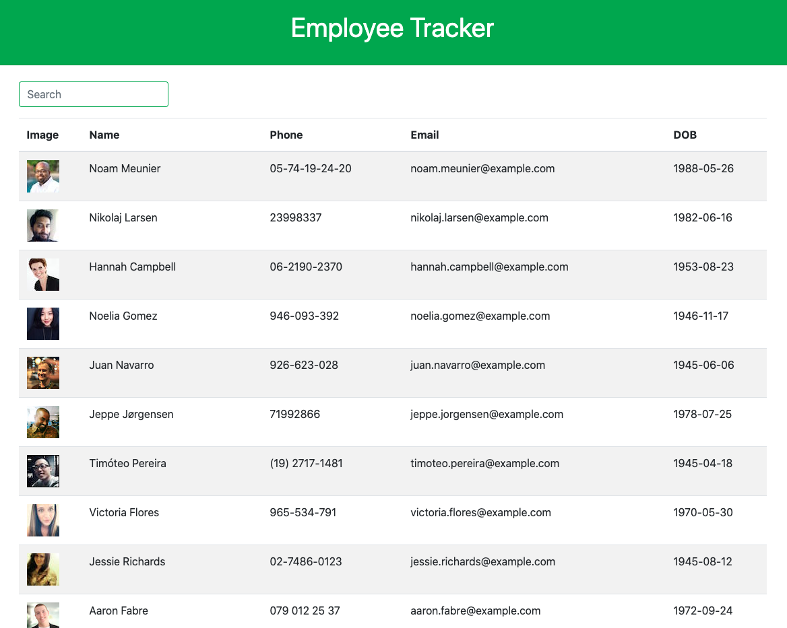

            
 # Employee_Tracker 
                                               
            
 # Description:
            
 The Employee Tracker application is business tool used by managers to view non sensitive information about their employees.  It features a filter by name search bar and provides a handy employee sorting function. 
            
 # Table Of Contents
            
 ### 1. Installation
            
 ### 2. Usage
            
 ### 3. License
            
 ### 4. Contributors           
            
 ### 5. Contact
            
 # Installation
            
 No installation neccessary
            
 # Usage
            
 The tracker is used to quickly access employee information.
            
 # License
            
 
            
 # Contributing
            
 Mark Prodehl
            
 # Contact
            
 
            
 markprodehl@gmail.com           
            
 GitHub Username: markprodehl  

                                
            